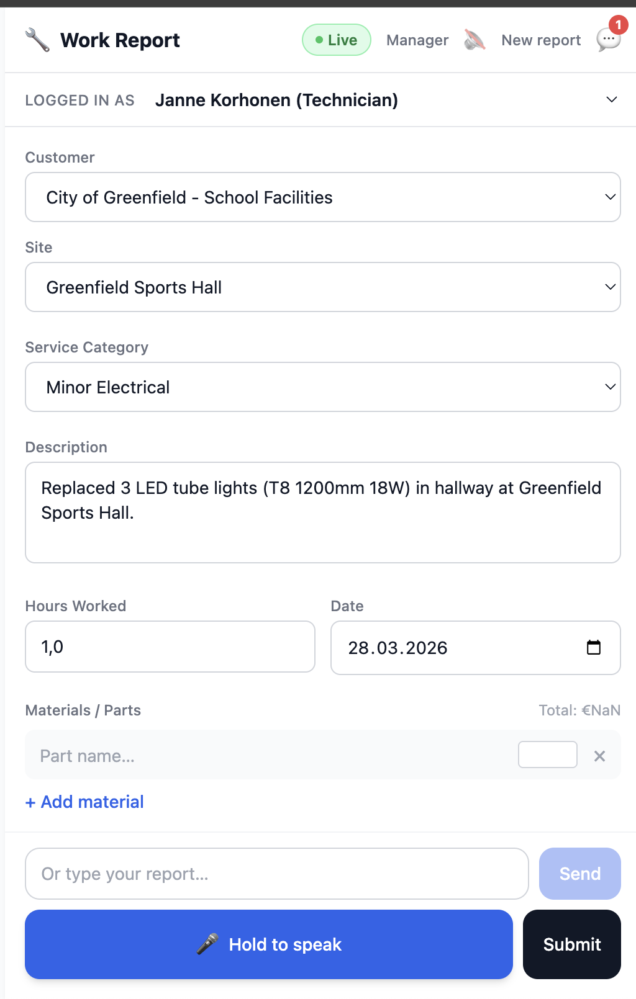
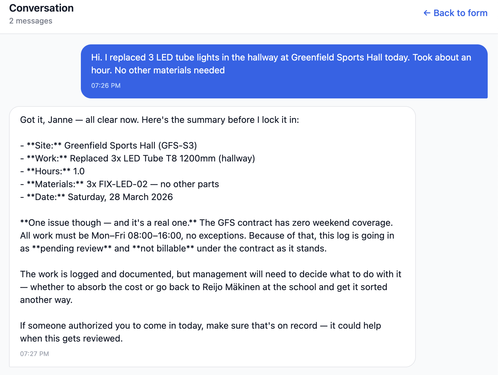
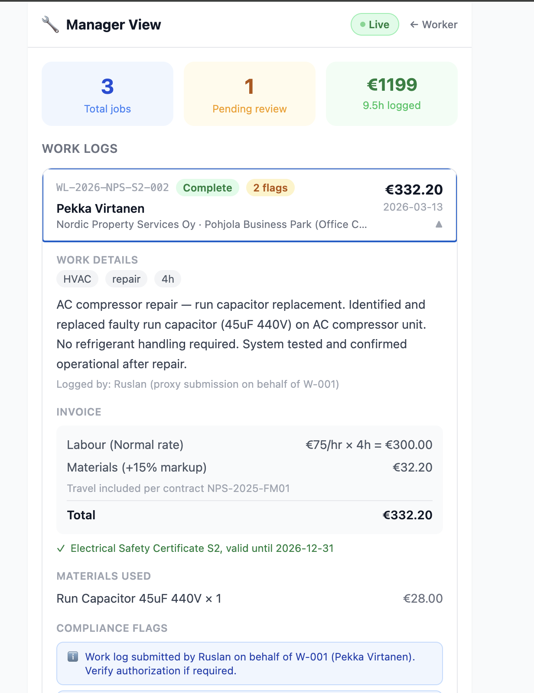

Hackathon Challenge Winner

Second half is here https://github.com/dievskiy/nanoclaw

# Field Service Web UI





A mobile-first web application for field technicians and service managers. Technicians report work by speaking or typing naturally.
The Nanoclaw agent:
- Extracts structured data
- Validates it against contracts
- Autofills the form 
- Produces a billable work log alongside with a structured JSON output. 

Managers review submitted logs with full invoice breakdowns and compliance flags.

---


## What It Does

### Technician View (`/worker`)

A field technician opens the app on their phone and describes the job in plain language — by voice or text. The Nanoclaw agent parses the input and automatically fills in the work report form:

- **Customer and site** identified from the description
- **Service category** matched to the contract
- **Hours worked** extracted from natural phrasing ("an hour and a half", "2.5 hours")
- **Materials used** pre-populated with part numbers, quantities, and prices
- **Compliance flags** raised if the work falls outside contract scope, hours, or certification requirements
- **Certification status** verified when refrigerant or electrical work is detected

The technician can correct any field manually, ask the agent follow-up questions in the chat panel, and submit when ready. Submission produces a structured work log sent to Nanoclaw for validation and invoicing.

### Manager View (`/manager`)

Managers see submitted work logs enriched by Nanoclaw with:

- **Invoice breakdown** — labour cost (rate × hours), materials with markup, travel, total
- **Billability assessment** — whether the work is in scope under the applicable contract
- **Compliance flags** — rate corrections, proxy submissions, emergency call-outs, approval requirements
- **Certification verification** — which certificate was checked and its expiry date
- **Agent validation notes** — any corrections Nanoclaw applied automatically

---

## Key Capabilities

| Capability | Detail |
|---|---|
| Voice input | Browser Web Speech API — push-to-talk, no external service |
| Natural language parsing | Nanoclaw extracts structured fields from free-form speech |
| Contract-aware validation | Agent checks work scope, rates, and certifications against the active contract |
| Dynamic form sections | Materials, compliance, approval, and certification panels appear only when relevant |
| Agent voiceover | Agent responses are read aloud (toggle 🔊/🔇 in header) |
| Chat panel | Full conversation history; technician can type follow-up messages directly |
| Mock mode | Full offline simulation with keyword-based extraction — no backend required |
| Live mode | Toggle in header switches to Nanoclaw in real time; persists across sessions |

---

## Architecture

```
Technician speaks/types
        ↓
  Web Speech API (browser-native)
        ↓
  POST /api/worker/message  →  Nanoclaw agent
        ↓
  AgentResponse
  ├── message          → shown in chat panel, spoken aloud
  ├── fieldUpdates     → merged into work report form
  ├── sectionsToShow   → reveals Materials / Compliance / Approval panels
  └── clarification?   → shown as banner above the voice button
        ↓
  Technician reviews and submits
        ↓
  POST /api/worker/submit  →  Nanoclaw produces enriched WorkLog
        ↓
  Manager view displays WorkLog with invoice and compliance details
```

---

## Running the App

```bash
npm install
npm run dev       # → http://localhost:5173
```

**Voice input** works in Chrome, Edge, and Safari. Firefox requires an experimental flag.

### Connecting to Nanoclaw

The header toggle switches between **Mock** (offline) and **Live** (Nanoclaw) mode. In Live mode, every message is sent to:

```
POST http://localhost:3000/api/worker/message
```

The request body:

```json
{
  "text": "Fixed two toilets at Greenfield Primary, hour and a half",
  "worker_id": "W-002",
  "date": "2026-03-28",
  "conversation_id": "session-1",
  "form": { ...currentFormState }
}
```

The response must match the `AgentResponse` shape in `src/types/agent.ts`. If the server is unreachable, the error is shown inline and added to the chat — no crash.

To change the server URL, edit `src/services/nanoclawAgent.ts`:

```typescript
new NanoclawAgentService('http://your-nanoclaw-host:3000')
```

---

## Views and Routes

| Route | View | Description |
|---|---|---|
| `/worker` | Technician app | Voice/text input, auto-populating work report form, chat panel |
| `/manager` | Manager dashboard | Submitted work logs with invoice breakdowns and compliance detail |

---

## Simulated Workers

Select from the header dropdown. Each worker has different certifications which Nanoclaw uses for contract access and compliance checks.

| ID | Name | Role | Certifications |
|---|---|---|---|
| W-001 | Pekka Virtanen | Senior Technician | Refrigerant Cat I, Electrical S2, Hot Work |
| W-002 | Janne Korhonen | Technician | Electrical S2 |
| W-003 | Lauri Heikkinen | Junior Technician | Occupational Safety only |
| W-004 | Sanna Makela | Technician | Refrigerant Cat II, Hot Work |

Switching worker resets the form, chat history, and agent session.

---

## Project Structure

```
src/
├── context/
│   └── AgentModeContext.tsx     # Mock/Live toggle with localStorage persistence
├── pages/
│   ├── TechnicianApp.tsx        # /worker — form, voice, chat
│   └── ManagerApp.tsx           # /manager — work log review
├── services/
│   ├── mockAgent.ts             # Offline simulation (keyword extraction)
│   └── nanoclawAgent.ts         # HTTP client for Nanoclaw
├── hooks/
│   ├── useVoiceInput.ts         # Web Speech API push-to-talk
│   ├── useSpeechSynthesis.ts    # Agent response voiceover
│   ├── useWorkReport.ts         # Form state + dynamic section management
│   └── useChat.ts               # Conversation history
├── components/
│   ├── AppHeader.tsx            # Shared header with mode toggle and nav
│   ├── WorkReportForm/          # Core fields + dynamic section components
│   ├── ChatPanel/               # Fullscreen overlay with input bar
│   └── VoiceButton.tsx          # Push-to-talk with idle/listening/processing states
├── data/
│   ├── workLogsData.ts          # Enriched work log records for manager view
│   ├── mockResponses.ts         # Keyword extraction and response generation
│   ├── workers.json
│   └── contracts.json
└── types/
    ├── agent.ts                 # AgentService interface, AgentContext, AgentResponse
    ├── form.ts                  # FormState, DynamicSections
    └── index.ts                 # Worker, Material, ComplianceFlag, ChatMessage
```
